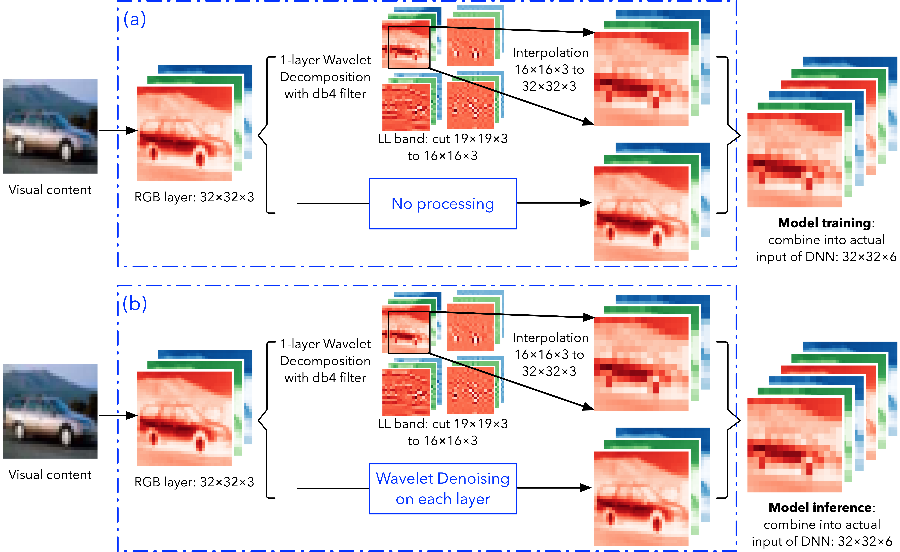
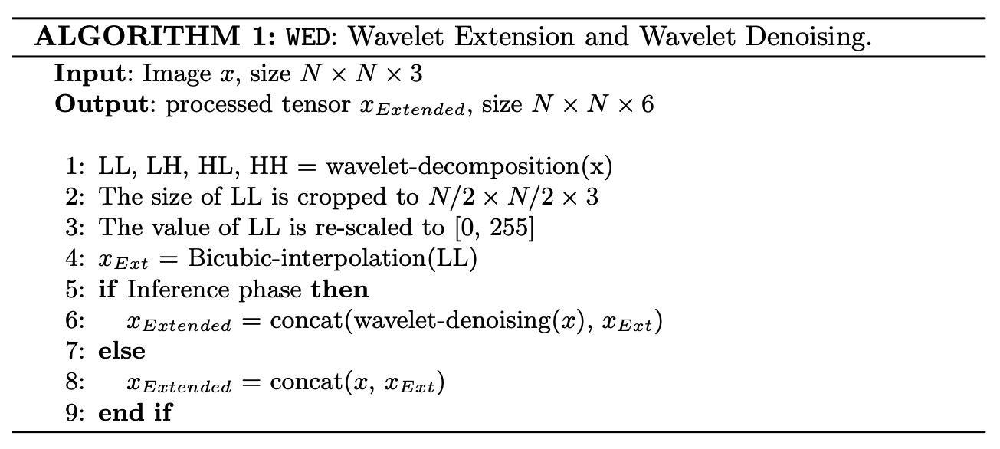
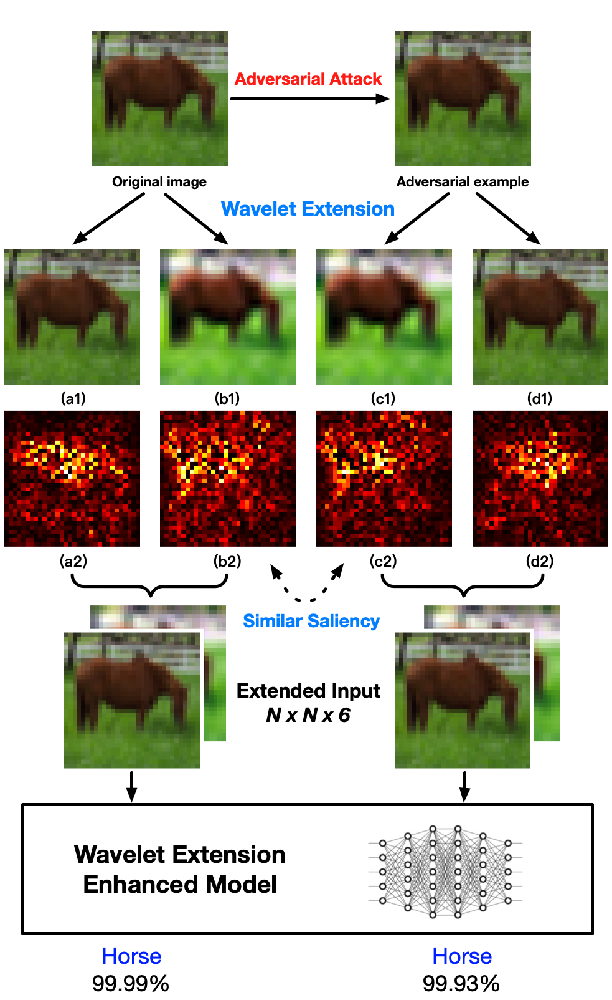

# Wavelet Extension and Denoising Defense on Adversarial Examples

The official implementation of the following [paper](https://personal.ntu.edu.sg/tianwei.zhang/paper/smartcom20.pdf): 

> *Resisting Adversarial Examples via Wavelet Extension and Denoising*
>
> Qinkai Zheng, Han Qiu, Tianwei Zhang, Gérard Memmi, Meikang Qiu and Jialiang Lu
>
> *Abstract*: It is well known that Deep Neural Networks are vulnerable to
adversarial examples. An adversary can inject carefully-crafted perturbations on clean input to manipulate the model output. Past years have
witnessed the arms race between adversarial attacks and defenses. In this
paper, we propose a novel method, WED, to better resist adversarial examples. Specifically, WED adopts a wavelet transform to extend the input
dimension with the image structures and basic elements. This can add
significant difficulty for the adversary to calculate effective perturbations.
WED further utilizes wavelet denoising to reduce the impact of adversarial
perturbations on the model performance. Evaluations show that WED can
resist 7 common adversarial attacks under both black-box and white-box
scenarios. It outperforms two state-of-the-art wavelet-based approaches
for both model accuracy and defense effectiveness.

## Introduction



We propose a novel approach, WED, to defend adversarial examples via Wavelet
Extension and Denoising. The key insight of our approach is that by extending
the input image into a higher dimensional tensor with non-differentiable wavelet
transforms, it is extremely difficult for the adversary to generate perturbations
that alter the model’s output. Specifically, WED consists of two innovations. The
first innovation is Wavelet Extension. WED adopts wavelet transform to extend
the input image into two scales: the original one and low-frequency one. These
two scales are then combined as one tensor as the input, which makes it difficult
to generate effective adversarial perturbations. The second innovation is to adopt
wavelet denoising only at the inference step. The original image, as one scale,
keeps the original visual content and elements to assist the model classification.
WED also utilizes wavelet denoising during the inference phase to reduce the
impact of the adversarial perturbations.

## Algorithm



## Visualization



We visually show the effectiveness of the wavelet extension by the saliency
map. The saliency map is obtained by first calculating gradients of outputs of
the penultimate layer with respect to the input images, and then by normalizing 
the absolute values of those gradients. A brighter pixel in the saliency map
means that the corresponding pixel in the original image has more influence on
the model’s output. The above figure shows that although the saliency maps of a clean
image (a2) and its AE (c2) are very different, the saliency maps of their extended
components are nearly identical (see (b2) and (d2)). This indicates that the wavelet
extension can effectively remove the effects of adversarial perturbations.

## Requirements

* scipy==1.5.2
* cleverhans==3.0.1
* PyWavelets==1.1.1
* matplotlib==3.3.1
* tensorflow==1.14.0
* scikit_image==0.16.2
* Keras==2.2.4
* joblib==0.16.0
* numpy==1.19.1
* ISR==2.2.0
* Pillow==8.3.0
* resnet==0.1
* skimage==0.0

## Citation

``````
@inproceedings{zheng2020resisting,
  title={Resisting Adversarial Examples via Wavelet Extension and Denoising.},
  author={Zheng, Qinkai and Qiu, Han and Zhang, Tianwei and Memmi, G{\'e}rard and Qiu, Meikang and Lu, Jialiang}
}
``````

If you have any question, please raise an issue or contact ```qinkai.zheng1028@gmail.com```. 